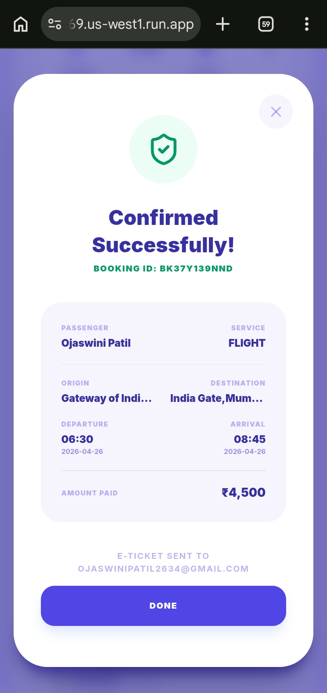
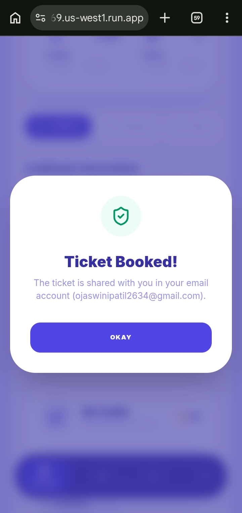
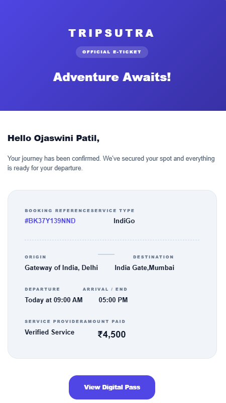

# 🚀 SmartRoute – AI-Powered Travel Booking & Route Optimization Platform

SmartRoute is an AI-powered travel assistant that helps users compare travel options, optimize routes, discover hotels and events, and generate personalized itineraries.

## 📱 Screenshots

### Home Dashboard & Travel Assistant

<table>
<tr>
<td>

</td>
<td width="80"></td>
<td>

</td>
</tr>
</table>

### Booking Page & Booking Search

<table>
<tr>
<td>

</td>
<td width="80"></td>
<td>

</td>
</tr>
</table>

### Booking List & Confirmed Booking

<table>
<tr>
<td>

</td>
<td width="80"></td>
<td>

</td>
</tr>
</table>

### Flight Bookings & Header Section

<table>
<tr>
<td>

</td>
<td width="80"></td>
<td>

</td>
</tr>
</table>

### Ticket Booked & Ticket View  

<table>
<tr>
<td>

</td>
<td width="80"></td>
<td>

</td>
</tr>
</table>

### Your Booking

<table>
<tr>
<td>

</td>
<td width="80"></td>
<td>

</td>
</tr>
</table>

## ✨ Features

- AI Travel Assistant (Gemini/Mistral AI)
- Multi-modal Route Optimization
- Interactive Maps
- Hotel & Event Discovery
- Firebase Authentication
- E-Ticket Generation
- Email Ticket Delivery

## 🛠️ Tech Stack

- React.js
- Node.js
- Express.js
- Firebase Firestore
- Firebase Authentication
- Tailwind CSS
- Leaflet Maps
- Gemini AI
- Mistral AI
- SendGrid API
